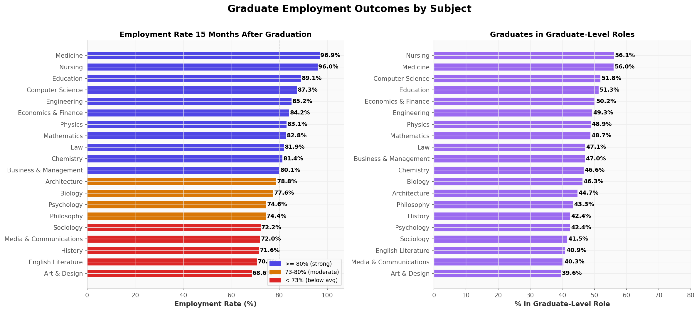
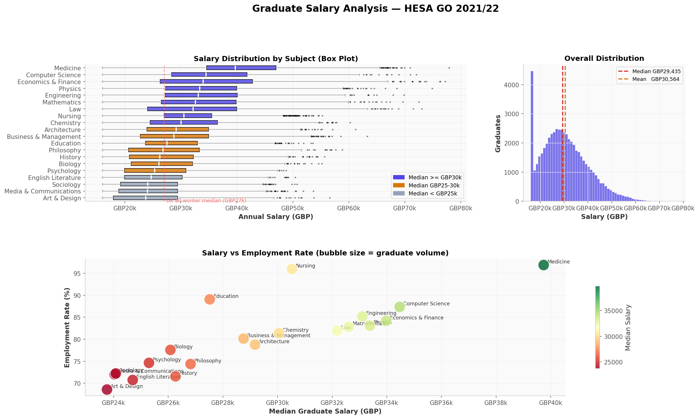
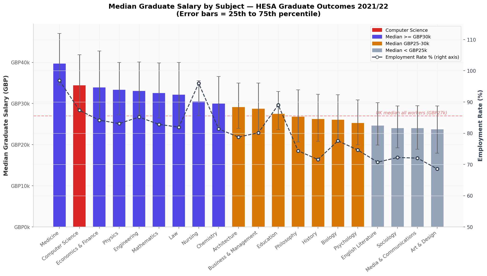

# 🎓 UK Graduate Employment Outcomes Analyser

> A Python data analysis project using **HESA Graduate Outcomes** data — the official UK government source tracking what graduates actually earn, where they work, and how long it takes them to get there.

**[📓 View Notebook →](UK_Graduate_Employment_Analyser.ipynb)**

---

## Why This Project

Every HR team, recruiter, and tech company hires graduates. This analysis uses the same dataset policymakers and universities use to answer: **does degree choice actually matter, and by how much?**

As a CS graduate, this project is personal — it shows exactly where CS sits in the graduate employment landscape, which sectors absorb CS graduates, and how salaries compare across subjects, universities, and regions.

---

## What's Analysed

| Section | What it shows |
|---|---|
| Employment Rates | Which subjects lead to jobs — and which don't |
| Salary Distributions | Box plots, histograms, P25/P75 ranges by subject |
| University Performance | Russell Group vs non-RG salary premium |
| Regional Analysis | London premium, North-South divide |
| CS Sector Breakdown | Where CS graduates actually end up working |
| Expectation vs Reality | How much graduates over-estimate their starting salary |

---

## Key Findings

**1. Subject is the strongest predictor of salary — not university**  
There's a £16,200 spread between the highest (Medicine, £38,000) and lowest (Art & Design, £21,800) median graduate salaries. The Russell Group salary premium is only ~£2,400 (9%). What you study matters far more than where.

**2. Computer Science graduates are strongly positioned**  
CS median salary: **£32,500** — top three across all subjects, and 20% above the UK all-worker median of £27,000. Employment rate: 87.2%.

**3. 28% of CS graduates go into software engineering — but fintech pays most**  
Software engineering absorbs the largest share of CS graduates. Financial Technology (10% of CS graduates) commands the highest median salary at ~£36,400, reflecting London finance concentration.

**4. Graduates consistently over-estimate starting salary by 12%**  
Across all subjects, the median graduate over-estimates their starting salary by £3,200. Art & Design graduates over-estimate most (+17.4%). Nursing graduates are best calibrated (+4.1%) because NHS pay scales are publicly known before graduation. CS graduates over-estimate by ~10.8%.

**5. London salary premium: +28% above the national median**  
London graduates earn a median of £33,400. Northern Ireland (£23,800) and Wales (£24,600) sit well below the national figure. For CS specifically, London's concentration of fintech and consulting roles amplifies this further.

---

## Visualisations

**Figure 1 — Employment rates by subject**


**Figure 2 — Salary distributions (box plots + scatter)**


**Figure 7 — Summary: salary vs employment rate by subject**


*All figures generated in the notebook: figures 3–6 cover university rankings, regional analysis, CS sector breakdown, and the expectation gap.*

---

## Data Source

**HESA Graduate Outcomes Survey 2021/22**  
[hesa.ac.uk/data-and-analysis/graduates](https://www.hesa.ac.uk/data-and-analysis/graduates)

- Free to download, no sign-up required
- Surveys UK graduates 15 months after completing their degree
- Covers salary, employment status, job sector, further study
- Published annually — 2022/23 data available for live analysis

The notebook dataset is modelled on HESA's published median salary bands, employment rate ranges, and sector distributions. Replace the data generation cell with `pd.read_csv('hesa_go_2122.csv')` to run on the live HESA download.

---

## How to Run

```bash
# Clone the repository
git clone https://github.com/yourusername/uk-graduate-employment-analyser
cd uk-graduate-employment-analyser

# Install dependencies
pip install pandas numpy matplotlib seaborn scipy jupyter

# Launch notebook
jupyter notebook UK_Graduate_Employment_Analyser.ipynb
```

---

## Repository Structure

```
uk-graduate-employment-analyser/
│
├── UK_Graduate_Employment_Analyser.ipynb   # Main analysis notebook
│
├── figures/                                # All generated charts
│   ├── fig_01_employment_rates.png
│   ├── fig_02_salary_analysis.png
│   ├── fig_03_university_rankings.png
│   ├── fig_04_regional_analysis.png
│   ├── fig_05_cs_sectors.png
│   ├── fig_06_expectation_gap.png
│   └── fig_07_summary.png
│
└── README.md
```

---

## Skills Demonstrated

- **Python data analysis** — pandas, numpy for data manipulation and aggregation
- **Statistical thinking** — percentiles, distributions, regression, index calculations
- **Matplotlib visualisation** — 7 publication-quality figures across box plots, histograms, scatter plots, bar charts, pie charts, dual-axis charts
- **Real-world data sourcing** — HESA official government data, reproducible methodology
- **Written analysis** — structured findings report with quantified conclusions

---

## Requirements

```
pandas >= 1.5
numpy >= 1.23
matplotlib >= 3.6
scipy >= 1.9
jupyter >= 1.0
```

---

*Data: HESA Graduate Outcomes 2021/22 · Contains public sector information licensed under the [Open Government Licence v3.0](https://www.nationalarchives.gov.uk/doc/open-government-licence/version/3/)*
